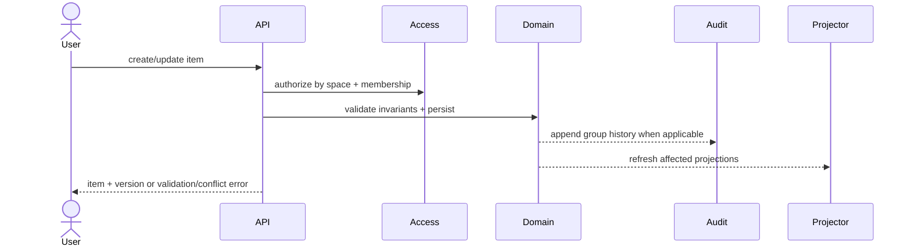
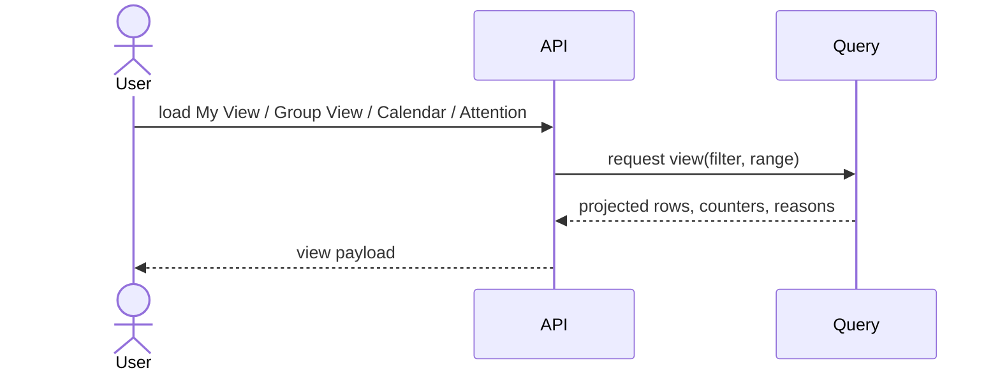

# Design: Product Foundation

## Technical Approach

Establish one write-side `Item` domain with explicit type invariants, then derive stack-agnostic read models for My View, Group View, Calendar, Undated, and Requires Attention. The implementation is organized into six boundaries: Identity/Membership, Space Access, Item Domain, Labels/Assignment, History, and Query/API. Because the repository has no product code yet, this document defines the first implementation slices and contracts.

## Architecture Decisions

| Decision | Options | Choice | Rationale / Tradeoff |
|---|---|---|---|
| Unified item modeling | Separate Task/Event, wrapper subtype, unified item | Unified `Item` + invariant policy | Keeps one CRUD contract for humans and agents and avoids duplicating labels, assignment, history, and space logic. Tradeoff: validation MUST stay strict. |
| Write/read separation | Single query-over-write model, derived views | Write model + derived projections | View semantics differ, so projections keep invariants centralized while allowing optimized filters later. Tradeoff: MVP MAY project synchronously first. |
| Group history | Snapshot only, event sourcing, audit beside state | Persist current state + append audit entries | Delivers “who changed what” without full event sourcing. Tradeoff: audit is descriptive, not replay-authoritative. |
| Concurrency | Last-write-wins, pessimistic locking, optimistic versioning | Optimistic version token on shared items | Prevents silent overwrites in group edits with minimal MVP complexity. Tradeoff: clients must retry on version mismatch. |
| Calendar completion behavior | Hide completed events by default, show by range, separate archive view | Show dated events by selected range by default | Matches range-based browsing expectations and keeps past completed events discoverable. Tradeoff: hiding completed events, if needed later, belongs to an explicit filter. |
| Attention threshold scope | Per-space settings, per-group settings, global product settings | Global MVP product settings | Ensures deterministic attention results across personal and group contexts. Tradeoff: no per-space tuning in MVP. |

## Data Flow

Identity/Membership verifies actor identity and group membership. Space Access resolves whether the actor can view or edit the item. Item Domain validates `item_type`, lifecycle, temporal rules, assignees, labels, and version. History records successful group changes. Query services project state into view-specific records consumed by UI or agents.

## Boundaries

- **Identity/Membership**: users, groups, membership, actor metadata.
- **Space Access**: `personal` and `group` visibility/edit authority.
- **Item Domain**: title, notes, `item_type`, status, dates, completion/cancel rules, `postpone_count`, version.
- **Labels/Assignment**: labels scoped to owner/group; assignees limited to valid owners or group members.
- **History**: append-only audit for group item changes.
- **Query/API**: projections and stable CRUD/query contracts.

## Read Model Rules

Write-side state is the source of truth. Read models only denormalize facts required for filtering: visibility scope, calendar span, undated state, attention reasons, assignee summary, and counters.

- **My View** includes personal items plus visible group items when the user is an assignee or the group item is unassigned.
- **Group View** includes all items for the selected group.
- **Requires Attention** is computed from persisted facts plus global product settings `attention_open_item_days` and `attention_postpone_count`.
- **Unassigned group items that require attention** MUST appear naturally in both My View and Group View through the same visibility/query rules; attention is a derived facet, not a separate ownership model.
- **Calendar** includes dated items by overlap with the selected day/week/month range. Completed events remain visible by default whenever their scheduled span overlaps the selected range. Undated items never appear in Calendar and remain reachable through Undated access.

## Interfaces / Contracts

- `POST /items`, `GET /items/{id}`, `PATCH /items/{id}`, `GET /items`
- `GET /views/my`, `GET /views/group/{groupId}`, `GET /views/calendar`, `GET /views/undated`, `GET /views/attention`
- `GET /items/{id}/history`

Filters SHOULD remain orthogonal: `space`, `group`, `item_type`, `status`, `assignee`, `label`, `priority`, `dated_state`, and optional `include_completed_events`.

## File Changes

| File | Action | Description |
|---|---|---|
| `openspec/changes/product-foundation/design.md` | Modify | Refine architecture decisions and remove resolved open questions. |
| `src/domain/` | Create later | Write-side entities, policies, and validation services. |
| `src/application/queries/` | Create later | View projectors and query handlers. |
| `src/interfaces/api/` | Create later | Human/agent CRUD and view endpoints. |

## Testing Strategy

| Layer | What to Test | Approach |
|---|---|---|
| Unit | Type invariants, lifecycle rules, attention thresholds, calendar overlap rules | Validate policy matrix and deterministic attention/calendar computations |
| Integration | Membership/edit authority, audit append, projection refresh, optimistic concurrency | Exercise command-to-projection flow across boundaries |
| E2E | Create/update items, load My View/Group View/Calendar/Attention, agent parity | Verify user-visible behavior against spec scenarios |

## Migration / Rollout

No migration required. Recommended sequence: 1) core value objects and invariants, 2) membership/access rules, 3) item commands + audit, 4) projections for views, 5) CRUD/query surface, 6) stack-specific UI adapters.

## Open Questions

None.
