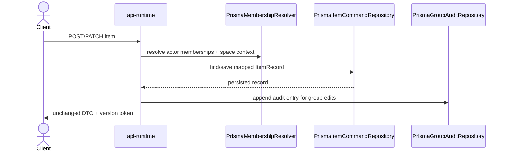
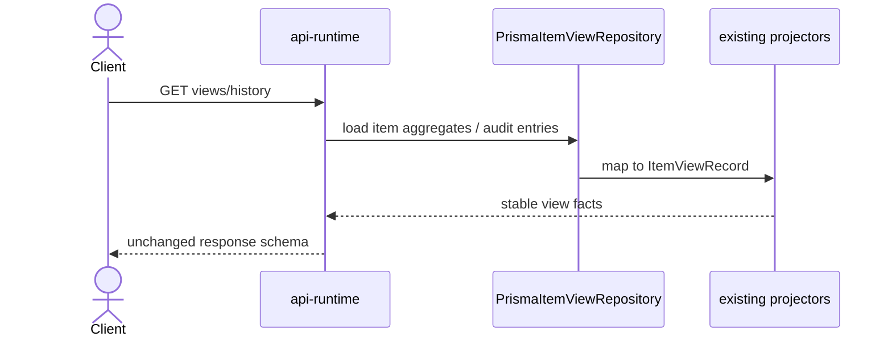

# Design: Prisma Persistence

## Technical Approach

Replace the singleton in-memory runtime backing with Prisma adapters, while keeping `src/lib/api-runtime.ts` request parsing, route handlers, DTO schemas, and application/domain contracts unchanged. Prisma becomes the runtime source of truth for items, memberships, and group audit history; existing query projectors still compute `ItemViewRecord` in memory from mapped records so App Router behavior stays contract-stable.

## Architecture Decisions

| Decision | Options | Choice | Rationale / Tradeoff |
|---|---|---|---|
| Persistence boundary | One god-repository vs separated adapters | Separate Prisma command, view, history, and identity adapters | Matches current application boundaries and keeps auth/membership evolution possible. Tradeoff: more mapper/plumbing files now. |
| Item storage model | Split task/event tables vs one item table | One `items` table with nullable temporal/lifecycle columns + `itemType` | Preserves the current unified `Item` contract and keeps optimistic concurrency simple. Tradeoff: DB-level nullability is broader than domain validity, so domain constructors remain authoritative. |
| Audit change storage | JSON blob vs normalized rows | `group_audit_entries` + normalized `group_audit_changes` rows | Keeps append-only ordering and future querying by change kind. Tradeoff: slightly more write complexity than JSON. |
| Membership truth | Keep mock memberships vs DB-backed runtime memberships | Persist memberships and resolve runtime access from Prisma | Eliminates split-brain for handlers. Tradeoff: mock identity may remain temporarily, but only as user selection, never authorization truth. |
| Read strategy | SQL-shaped views now vs map-then-project | Load relational item aggregates, then reuse existing projectors | Minimizes disruption to UI and route contracts. Tradeoff: MVP may overfetch; query pushdown can follow later. |

## Data Flow

## File Changes

| File | Action | Description |
|---|---|---|
| `prisma/schema.prisma` | Modify | Add `User`, `Group`, `Membership`, `Space`, `Item`, `ItemAssignee`, `Label`, `ItemLabel`, `GroupAuditEntry`, `GroupAuditChange`. |
| `src/interfaces/persistence/prisma/*` | Create | Prisma repositories, aggregate loaders, and record mappers. |
| `src/lib/item-command-factory.ts` | Modify | Compose Prisma adapters as the default runtime wiring. |
| `src/lib/api-runtime.ts` | Modify | Remove direct `runtimeStore` history/query coupling; depend on repositories only. |
| `src/lib/mock/actor.ts` | Modify | Keep header-based actor selection, but load memberships/spaces from Prisma. |
| `src/lib/runtime-store.ts` | Modify | Restrict to tests/controlled fallback; no production reads. |
| `prisma/seed.ts` | Create | Seed one shared dev truth for users, groups, memberships, spaces, labels, and sample items. |
| `tests/integration/api/*` | Modify | Run route-contract scenarios against Prisma-backed runtime. |

## Interfaces / Contracts

- Prisma schema boundaries: `items` owns core state; join tables own assignees and labels; `memberships` is the only runtime group-truth source; audit tables are append-only and never mutated.
- Mapping rules: Prisma rows map into existing `ItemRecord`, `ItemOutput`, `ItemViewRecord`, and `GroupItemAuditEntry`; mappers normalize nullable DB columns into current discriminated temporal/lifecycle shapes.
- Repository split:
  - `PrismaItemCommandRepository`: `findById`, `save`, version-checked group updates.
  - `PrismaItemViewRepository`: load visible item aggregates for projectors.
  - `PrismaGroupItemHistoryRepository`: ordered audit retrieval by `itemId`.
  - `PrismaMembershipResolver`: actor user, visible groups, memberships, and command space hydration.

## Testing Strategy

| Layer | What to Test | Approach |
|---|---|---|
| Unit | Prisma mappers, scope-label uniqueness, audit row reconstruction | Pure Vitest around mapping/serialization boundaries |
| Integration | CRUD, optimistic concurrency, membership-based access, unassigned visibility, restart-safe history | Prisma test database with seed/reset helpers; reuse existing scenarios |
| E2E | None in this slice beyond existing optional coverage | Keep Playwright unchanged until UI stops using mock-only screens |

## Migration / Rollout

Sequence: 1) schema + migrations, 2) seed/bootstrap constants shared by mock actor + Prisma seed, 3) mappers, 4) command repository, 5) audit/history repository plus `getItemHistory` decoupling, 6) membership resolver, 7) view repository, 8) Prisma-backed integration tests, 9) demote `runtimeStore` to tests only. No route migration is required.

## Open Questions

- [ ] None.
